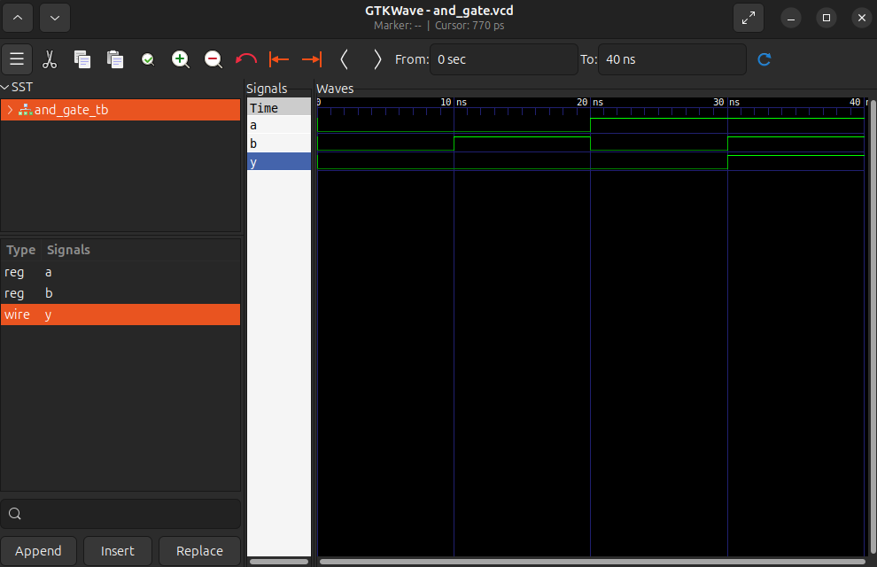

# AND Gate

Primul meu modul Verilog. Poarta logică AND cu 2 intrări și o ieșire, 
simulată cu Icarus Verilog și vizualizată în GTKWave.

## Fișiere:

- `and_gate.v`
- `and_gate_tb.v`
- `waveform.png`

## Cum se rulează

Necesar: Icarus VErilog, GTKWave

​```bash
iverilog -o and_gate_sim and_gate.v and_gate_tb.v
vvp and_gate_sim
gtkwave and_gate.vcd
​```

## Waveform



În cele 4 ferestre de 10 ns, a și b parcurg combinațiile 00, 01, 10, 11. y rămâne 0 în primele trei și sare la 1 doar în ultima — semnătura vizuală a unui AND.

## Ce am învățat

- modulul = un circuit fizic
- assign = stabilește o conexiune permanentă
- wire = conductor electric fizic care nu stochează nimic, nu are memorie
- reg = semnal căruia i se pot atribui valori


## Resurse folosite

- [Icarus Verilog](http://iverilog.icarus.com/)
- [GTKWave](https://gtkwave.sourceforge.net/)