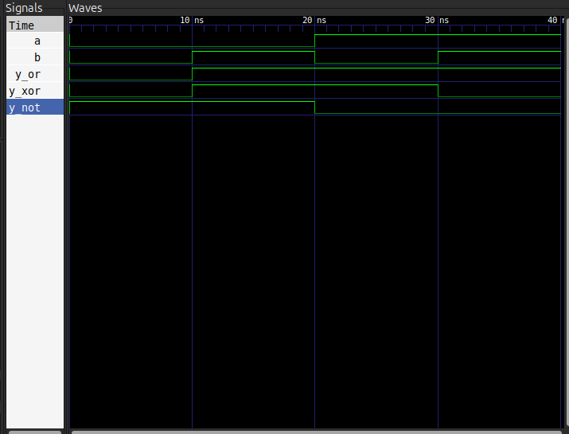

# Basic Gates

3 module: porți pentru operațiile logice: OR, XOR și NOT;
simulate cu Icarus Verilog și vizualizate în GTKWave.

## Fișiere:

- `or_gate.v`
- `xor_gate.v`
- `not_gate.v`
- `basic_gates_tb.v`
- `waveform.png`

## Cum se rulează

Necesar: Icarus Verilog, GTKWave

​```bash
iverilog -o basic_gates_sim or_gate.v xor_gate.v not_gate.v basic_gates_tb.v
vvp basic_gates_sim
gtkwave basic_gates.vcd
​```

## Waveform



În cele 4 ferestre de 10 ns, `a` și `b` parcurg combinațiile 00, 01, 10, 11.

- `y_or` e 0 doar când ambele intrări sunt 0, în rest e 1 — semnătura vizuală a unui OR;

- `y_xor` e sus exact când `a` și `b` sunt diferite, jos când sunt egale — semnătura vizuală a unui XOR;

- `y_not` e inversul lui `a` — depinde doar de `a`, nu și de `b` — semnătura vizuală NOT.

## Ce am învățat

- nu putem conecta două output-uri la același wire deoarece nu o să mai avem două rezultate distincte

- putem simula mai multe module într-un singur testbench

- operatorii pe biți în Verilog: `&` (AND), `|` (OR), `^` (XOR), `~` (NOT)

- `~` e diferit de `!` (logic NOT)

## Resurse folosite

- [Icarus Verilog](http://iverilog.icarus.com/)
- [GTKWave](https://gtkwave.sourceforge.net/)
