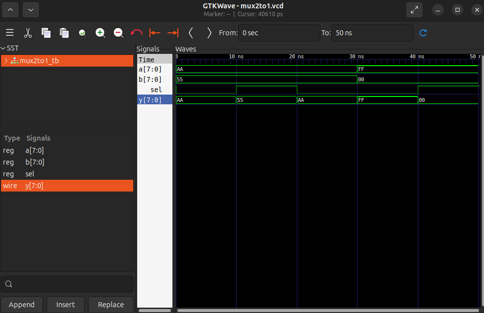

# Multiplexor 2-la-1

Un modul care alege între două intrări pe baza unui semnal de selecție, 
simulat cu Icarus Verilog și vizualizat în GTKWave.

## Fișiere:

- `mux2to1.v`
- `mux2to1_tb.v`
- `waveform.png`

## Cum se rulează

Necesar: Icarus Verilog, GTKWave

​```bash
iverilog -o mux2to1_sim mux2to1.v mux2to1_tb.v
vvp mux2to1_sim
gtkwave mux2to1.vcd
​```

## Waveform



Avem 5 ferestre; în primele 3 `a = AA`, `b = 55`, iar în celelalte 2 `a = FF`, `b = 00`:

- Fereastra 1: `sel = 0` => `y` (output-ul) = AA

- Fereastra 2: `sel = 1` => `y` (output-ul) = 55

- Fereastra 3: `sel = 0` => `y` (output-ul) = AA

- Fereastra 4: `sel = 0` => `y` (output-ul) = FF

- Fereastra 5: `sel = 1` => `y` (output-ul) = 00

## Ce am învățat

- Cum se scrie un vector cu mai mulți biți (ex: `a = 8'b1111_0000`).

- Cum se folosește corect operatorul ternar `?`: pentru logică combinațională (`assign y = sel ? b : a`).

- Cum scriem un vector în diferite formate (hexadecimal: `8'hAA`, binar: `8'b...`).

- Simularea rulează chiar dacă anterior am primit un warning, dar rezultatul acesteia va fi incorect.

    - Exemplu: În testbench am declarat `wire y` în loc de `wire [7:0] y`. Am ignorat avertismentul și nu înțelegeam de ce în waveform rezultatul era reprezentat pe un singur bit.

## Decizii de design în testbench

Am ales să atribui lui `a` și `b` doar două seturi de valori în cele 5 cazuri de testare pentru a putea observa clar ce anume cauzează schimbarea semnalului de ieșire `y` (schimbarea intrărilor sau a selecției).

## Resurse folosite

- [Icarus Verilog](http://iverilog.icarus.com/)
- [GTKWave](https://gtkwave.sourceforge.net/)
