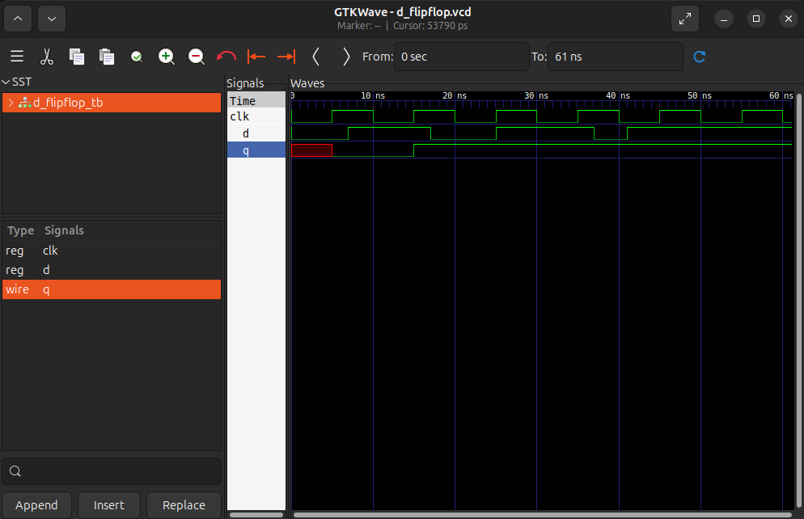

# Flip-Flop D

Un flip-flop D dă valoarea lui `d` lui `q` atunci când `clk` primește un impuls 0->1 (**posedge**). 
Dacă `d` își schimbă valoarea, `q` rămâne neschimbat până la următorul impuls al lui `clk`.

## Fișiere
- `d_flipflop.v`
- `d_flipflop_tb.v`
- `waveform.png`

## Cum se rulează
Necesar: Icarus Verilog, GTKWave

​```bash
iverilog -o d_flipflop_sim d_flipflop.v d_flipflop_tb.v
vvp d_flipflop_sim
gtkwave d_flipflop.vcd
​```

## Waveform


`q` ia valoarea lui `d` doar atunci când `clk` primește un impuls 0->1.

## Combinațional vs Secvențial
Circuitul combinațional (ex. MUX) reacționează instant: dacă intrările își schimbă valoarea, ieșirea se modifică și ea imediat. În schimb, cel secvențial (ex. Flip-flop D) reacționează doar la fronturile crescătoare ale semnalului de ceas (`posedge clk`).

## Ce am învățat
- `always @(posedge clk)` — execută codul din bloc la fiecare front crescător (muchie crescătoare) al lui `clk`.

- În instrucțiunile de tip assign folosim atribuirea continuă `=`, în schimb în blocurile `always @(posedge clk)` folosim atribuirea non-blocantă `<=`.

- Folosim tipul de date `reg` și nu `wire` pentru ca `q` să își mențină (să țină minte) valoarea până la următorul semnal `clk`.

- Generarea ceasului în testbench se face într-un bloc separat care inversează valoarea lui clk la un interval fix:

     ```verilog
     initial clk = 0;
     always #5 clk = ~clk;
     ​```

-  La început, `q` are valoarea `x` (nedefinită) deoarece flip-flop-ul nu a primit încă niciun `posedge`. De aceea avem nevoie de un semnal de reset, pentru a forța `q` la o valoare cunoscută (de obicei 0) la pornire, în loc să rămână `x`.

## Resurse folosite
- [Icarus Verilog](http://iverilog.icarus.com/)
- [GTKWave](https://gtkwave.sourceforge.net/)