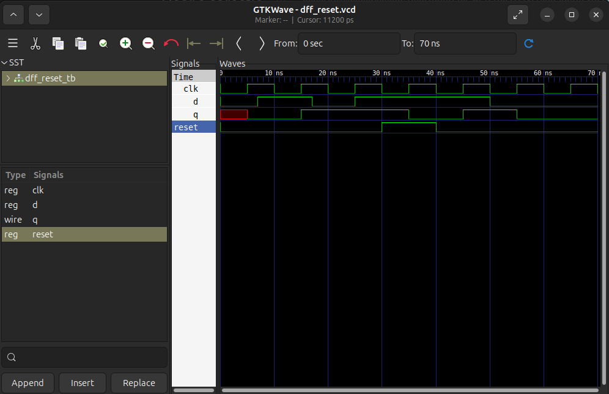

# Flip-Flop D Reset

Un flip-flop D care are un „buton" de `reset`, care, odată activat, transmite valoarea 0 lui `q`, indiferent de `d`.

## Fișiere
- `dff_reset.v`
- `dff_reset_tb.v`
- `waveform.png`

## Cum se rulează

Necesar: Icarus Verilog, GTKWave

```bash
iverilog -o dff_reset_sim dff_reset.v dff_reset_tb.v
vvp dff_reset_sim
gtkwave dff_reset.vcd
```

## Waveform


Putem observa reset-ul în momentul 35ns: `q` ia valoarea 0 în ciuda faptului că `d` este 1.
Asta arată că `reset` are prioritate.

## Reset sincron vs. Reset asincron

În modulul nostru am folosit un reset sincron. Diferența dintre cele două este:

- **Resetul sincron:**
  - efect la următorul `posedge clk`
  - nu merge dacă ceasul e oprit (are nevoie de `posedge`)

- **Resetul asincron:**
  - efect imediat
  - nu depinde de ceas

## Ce am învățat

- Cum se folosește structura `if(...) else`

- Diferența dintre reset sincron și asincron (discutată mai sus)

- Resetul are prioritate deoarece este un buton de „avarie" — dacă `d` ar câștiga, reset-ul nostru nu s-ar produce niciodată

- Un testbench de reset trebuie să prindă cazul `reset=1` simultan cu `d=1`, pentru a observa că reset-ul funcționează. Dacă `reset=1` și `d=0`, `q` ar lua valoarea 0 indiferent dacă se acționează resetul sau nu

## Resurse folosite
- [Icarus Verilog](http://iverilog.icarus.com/)
- [GTKWave](https://gtkwave.sourceforge.net/)
