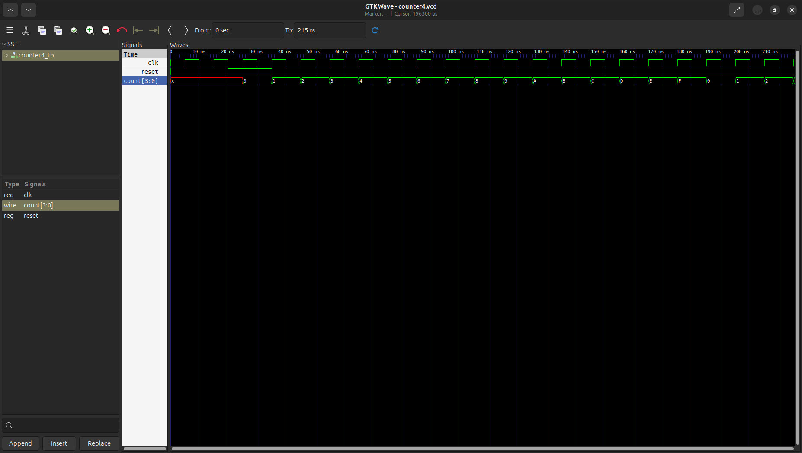

# Counter 4-bit

Acest modul este diferit de cele pe care le-am făcut până acum, deoarece
se alimentează singur — își folosește `output`-ul precedent pentru a-l
calcula pe următorul.

## Fișiere
- `counter4.v`
- `counter4_tb.v`
- `waveform.png`

## Cum se rulează
Necesar: Icarus Verilog, GTKWave

```bash
iverilog -o counter4_sim counter4.v counter4_tb.v
vvp counter4_sim
gtkwave counter4.vcd
```

## Waveform


`Count`-ul nostru începe fără `reset`, acesta fiind `x`. Atunci când `reset`-ul
se activează, `count`-ul iese din zona roșie. Se poate observa și momentul de
overflow `F→0`. GTKWave afișează `count`-ul în hex.


## Wrap-around (overflow)

Numărul maxim scris pe 4 biți în binar este 15 (`1111`). Atunci când se mai
adaugă un 1 la `count`, numărul nostru ar deveni `10000`, dar din cauza că
`count`-ul nostru are 4 biți, bitul 5 se pierde, numărul devenind `0000`.

## De ce reset-ul e obligatoriu aici

`Reset`-ul este obligatoriu deoarece `count` ar rămâne mereu `x`. Se poate
observa în `waveform` cum `count` rămâne în zona roșie până la activarea
`reset`-ului.

## Ce am învățat
- `count`-ul este independent — își folosește valoarea precedentă
- un counter pe N biți numără până la: `2^N - 1`
- dacă `count`-ul trece de limita sa (overflow), bitul suplimentar se pierde și rămân doar cei N corespunzători
- `reset`-ul este obligatoriu deoarece `x+1=x`
- `#` e întârziere relativă, timp cumulativ — nu moment absolut


## Resurse folosite
- [Icarus Verilog](http://iverilog.icarus.com/)
- [GTKWave](https://gtkwave.sourceforge.net/)
