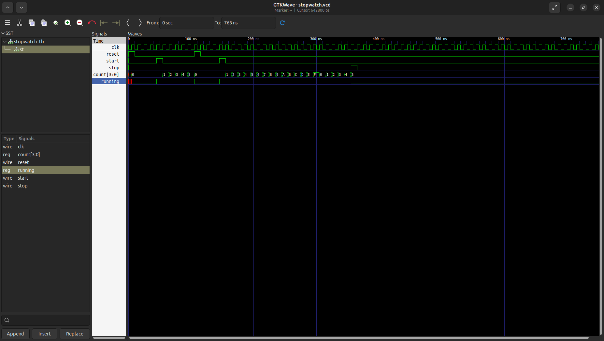

# Stopwatch

Acest circuit este un cronometru cu 3 butoane: `start`, `stop` și `reset`.
Cronometrul începe cu apăsarea lui `start`, incrementează până la apăsarea lui `stop`, iar apăsarea lui `reset` resetează cronometrul.

## Fișiere
- `stopwatch.v`
- `stopwatch_tb.v`
- `waveform.png`

## Cum se rulează
Necesar: Icarus Verilog, GTKWave

```bash
iverilog -o stopwatch_sim stopwatch.v stopwatch_tb.v
vvp stopwatch_sim
gtkwave stopwatch.vcd
```

## Waveform


Începem cu un semnal `reset`, acesta schimbă valoarea `count`-ului în 0.
`count`-ul rămâne 0 până la primirea semnalului `start` (start devine 1, care activează `running`), iar `count`-ul se incrementează la fiecare semnal de tact.
Circuitul primește încă un semnal reset care transformă atât `count`-ul cât și
`running`-ul în 0. După acest reset, `start`-ul primește încă un semnal, iar `count`-ul se incrementează până la primirea semnalului `stop` (acesta transformă `running` în 0). Putem observa că `count` este pe 4 biți și are parte de un wrap după valoarea `F` (15).


## De ce reset-ul e obligatoriu aici

`Reset`-ul este obligatoriu deoarece `count` ar rămâne mereu `x`.

## Ce am învățat
- pentru a implementa un circuit `start`-`stop`, avem nevoie obligatoriu de un `reg` care să rețină modul în care ne aflăm, deoarece `start`-`stop` sunt doar niște butoane care dau niște impulsuri

- avem nevoie de mai multe blocuri `if...else`, unul pentru a determina starea lui `running`, și altul pentru valoarea lui `count`

- cum să proiectez pe foaie corect momentele din testbench în care impulsurile au loc, pentru a putea acoperi fiecare caz


## Resurse folosite
- [Icarus Verilog](http://iverilog.icarus.com/)
- [GTKWave](https://gtkwave.sourceforge.net/)
