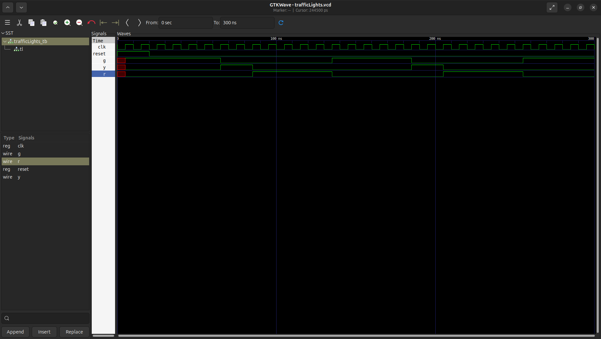

# Traffic Lights — Finite-State Machine

Acest circuit simulează comportamentul unui semafor. Este un FSM deoarece are un număr finit de stări (`GREEN`, `YELLOW` și `RED`). Schimbarea dintre stări se numește tranziție.

## Fișiere
- `trafficLights.v`
- `trafficLights_tb.v`
- `waveform.png`

## Cum se rulează
Necesar: Icarus Verilog, GTKWave

```bash
iverilog -o trafficLights_sim trafficLights.v trafficLights_tb.v
vvp trafficLights_sim
gtkwave trafficLights.vcd
```

## Waveform


Începem cu un `reset` care stă activ 2 cicluri; acesta aduce FSM-ul în starea `GREEN` și, după eliberarea lui, circuitul începe să numere. `GREEN` rămâne activ timp de 5 cicluri, moment în care se face tranziția la starea `YELLOW`. Aceasta durează 2 cicluri, după care urmează tranziția `YELLOW` → `RED`, stare care durează și ea 5 cicluri. După `RED`, revenim la `GREEN`. În waveform-ul nostru se regăsesc două cicluri complete `GREEN` → `YELLOW` → `RED` și începutul celui de-al treilea (doar starea `GREEN`).

## Ce am învățat
- **Finite-State Machine (FSM)**: un circuit cu un număr finit de stări care influențează output-ul. Circuitul nostru folosește modelul Moore deoarece output-ul este influențat doar de stare, nu și de input.

- **Secvențial vs. combinațional**:
    - secvențial (`@(posedge clk)`, `<=`) — când am nevoie de tact (ex. `counter`)
    - combinațional (`@(*)`, `=`) — când nu am nevoie de tact (ex. când selectez output-urile în funcție de stare)

- **`localparam`**: în loc să codific fiecare stare ca `00`, `01` etc., am declarat constante cu nume. Codul devine astfel mai ușor de urmărit atât pentru cel care îl scrie, cât și pentru oricine îl citește ulterior, mai ales când se lucrează cu mai multe stări.

## Resurse folosite
- [Icarus Verilog](http://iverilog.icarus.com/)
- [GTKWave](https://gtkwave.sourceforge.net/)
