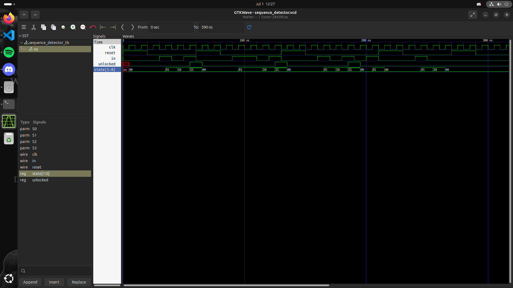

# Sequence Detector
Acest circuit primește mai multe semnale, iar când detectează secvența corectă, deblochează circuitul.

## Fișiere
- `sequence_detector.v`
- `sequence_detector_tb.v`
- `waveform.png`

## Cum se rulează
Necesar: Icarus Verilog, GTKWave

```bash
iverilog -o sequence_detector_sim sequence_detector.v sequence_detector_tb.v
vvp sequence_detector_sim
gtkwave sequence_detector.vcd
```

## Stări
Circuitul are 4 stări codificate pe 2 biți:
- **S0** (`2'b00`) — stare inițială / reset, nu s-a primit nimic relevant
- **S1** (`2'b01`) — s-a primit primul `1`
- **S2** (`2'b10`) — s-a primit `1-0`
- **S3** (`2'b11`) — s-a primit `1-0-1`, `unlocked = 1`

## Waveform


Putem observa că circuitul primește niște semnale `in`, iar la întâlnirea secvenței `101`, `unlocked` devine activ timp de un ciclu de tact. `state[1:0]` trece prin S0 → S1 → S2 → S3 la fiecare detecție reușită, după care revine în S0. Se pot observa și tranziții de eșec, de exemplu S2 → S0 când `in=0`, unde FSM-ul o ia de la capăt.

## Ce am învățat
- **Tranzițiile depind de input**: spre deosebire de semaforul proiectat în slotul trecut, în care tranzițiile depindeau de un `counter`, acum tranzițiile depind de un `in` și sunt mai „haotice", contează ce secvență primește circuitul.

- **Overlapping vs non-overlapping**: ce faci după ce secvența s-a completat și ai deschis?  
    - Overlapping: ultimul `1` al secvenței este luat în calcul la următoarea secvență.
    - Non-overlapping: după deschidere, secvența o ia de la starea de start.
    - În acest circuit am folosit non-overlapping deoarece am considerat că la secvența corectă, ultimele pulsuri au fost folosite în deschidere.

- **Suprapunerea pe eșec**: un input greșit poate fi începutul unei noi secvențe (ex. dacă circuitul primește `11`, nu o ia de la început, continuă cu acel ultim `1`)

## Resurse folosite
- [Icarus Verilog](http://iverilog.icarus.com/)
- [GTKWave](https://gtkwave.sourceforge.net/)
